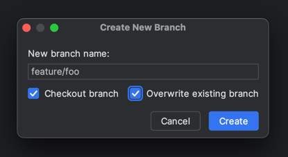
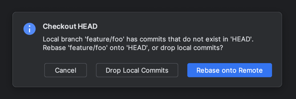

= IntelliJ Idea

== Debugging

:label: Setup Spring Boot DevTools
:date: 04-01-2023
:source: link:https://www.youtube.com/watch?v=BvIM9gNTDM4[YouTube]
include::partial$item.adoc[]

1. Include the dependency in `pom.xml`:
+
[source,xml]
----
<dependency>
    <groupId>org.springframework.boot</groupId>
    <artifactId>spring-boot-devtools</artifactId>
    <scope>runtime</scope>
    <optional>true</optional>
</dependency>
----

2. Navigate to Settings → Build, Execution, Deployment → Compiler:

3. Enable Build project automatically
Navigate to Settings → Advanced Settings:

4. Enable Allow auto-make to start even if the developed application is currently running.

== Change a base branch

Assume these branches:

- `develop` with the current 2.X baseline.
- `release/1.X` with the previous 1.X release.
- `feature/foo` created from `develop` with some commits.

The goal is to change a base branch without lengthy rebasing. Assume huge changes between `develop` and `release/1.X`.

=== Steps

1. Squash all commits in `feature/foo` and force push.
2. Check-out the target base branch `release/1.X`.
3. Cherry-pick the commit(s) from `feature/foo` but *DON'T* force push: the commit becomes active.
4. Create a new branch `feature/foo` and select *"Overwrite existing branch"*.
+

5. On a new modal window "Checkout HEAD" select *"Drop Local Commits"*.
+

6. Push the branch.

=== Disclaimer:

> I don't know if this is a correct approach, but it works for me.
> If I select "Rebase onto Remote" instead, upon painful conflicts fixing the result is usually odd.

